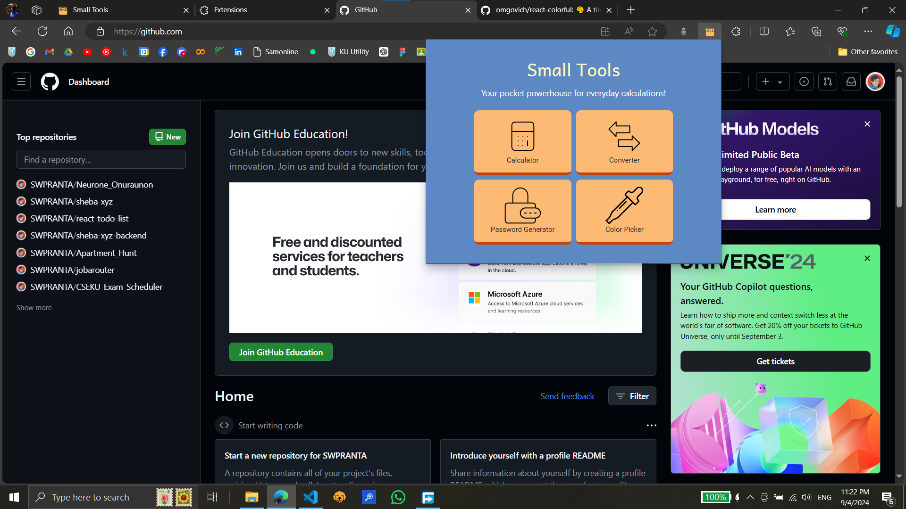

# Small Tools: Because life's too short for small tasks...

## **Features**

Small Tools is packed with features to help you tackle everyday tasks:

**🧮 Simple Calculator:** Need to add, subtract, multiply, or divide? Our built-in calculator has you covered.

**🔄 Converter:**  Switch between different units with our versatile converter. Whether you're dealing with kilograms and pounds, dollars and euros, or Celsius and Fahrenheit, we've got you covered.

**🔐 Random Password Generator:** Generate strong, random passwords to keep your accounts secure.

**🎨 Color Picker:**  Find the perfect color for your project with our intuitive color picker.

## How to Use

As I have not published the extension to any web store like Chrome or Edge😔, there are two ways to install this extension:

**1. Build from Source**

* **Prerequisites:** Make sure you have Node.js and npm installed.
* **Steps:**
  1. Clone the repository: `git clone https://github.com/SWPRANTA/small-tools-a-google-extension.git`
  2. Navigate to the project directory: `cd <project directory>`
  3. Install dependencies: `npm install`
  4. Build the extension: `npm run build`
  5. Go to your browsers manage extension option.
  6. Turn on the `dev` mode and click "Load unpacked" option and then select the `dist` folder to load the extension.

**2. Download Pre-built Extension**

* **Steps:**
  1. Download the `dist` folder from this page.
  2. Go to your browsers manage extension option.
  3. Turn on the `dev` mode and click "Load unpacked" option and then select the `dist` folder to load the extension.

You are good to go now...😊

Loved❤ this extension? Give it a star⭐on GitHub and spread the word! I'm always open to suggestions, so let me know what you think.
